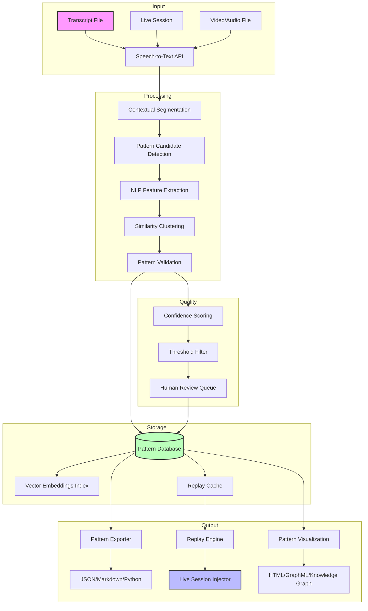

# Lesson Pattern Vault: Smart Session Pattern Extractor & Replay System

[](https://michael23-oss.github.io/pi-pattern-weaver/)

A revolutionary open-source tool designed to extract, catalog, and replay reusable problem-solving patterns from any educational or professional session transcript. Think of it as a **personal pattern library** that learns from your conversations.

[](https://opensource.org/licenses/MIT)
[](https://python.org)
[](https://openai.com)
[](https://anthropic.com)

---

## Table of Contents

1. [Why This Exists](#why-this-exists)
2. [Core Algorithm - The Pattern Mining Engine](#core-algorithm---the-pattern-mining-engine)
3. [Feature Matrix](#feature-matrix)
4. [OS Compatibility](#os-compatibility)
5. [Installation & Setup](#installation--setup)
6. [Quick Start: Example Profile Configuration](#quick-start-example-profile-configuration)
7. [Example Console Invocation](#example-console-invocation)
8. [API Integration Deep Dive](#api-integration-deep-dive)
   - [OpenAI API Configuration](#openai-api-configuration)
   - [Claude API Configuration](#claude-api-configuration)
9. [Mermaid Diagram - Extraction Pipeline](#mermaid-diagram---extraction-pipeline)
10. [Responsive UI & Multilingual Support](#responsive-ui--multilingual-support)
11. [24/7 Customer Support Architecture](#247-customer-support-architecture)
12. [Disclaimer & Ethical Use](#disclaimer--ethical-use)
13. [License](#license)
14. [Community & Contribution](#community--contribution)

---

## Why This Exists

Every problem solved, every lesson learned, every breakthrough achieved in a session - **owes its existence to a pattern**. Yet, these patterns evaporate into the ether of forgotten transcripts. Lesson Pattern Vault is the **time machine for your intellectual property**. It doesn't just store transcripts; it **digests** them, extracting the DNA of problem-solving - the reusable templates, the mental shortcuts, the algorithmic steps - and presents them back to you as executable knowledge.

**Unlike traditional note-taking tools** that treat every session as a monolithic blob, our engine treats sessions as **pattern incubators**. It finds the signal in the noise, the repeatable in the unique, the lesson in the conversation.

---

## Core Algorithm - The Pattern Mining Engine

The heart of this system is a **multi-pass extraction algorithm** that operates in three phases:

1. **Contextual Segmentation**: Splits transcripts into logical problem-solving episodes using semantic boundary detection.
2. **Pattern Recognition**: Uses NLP models to identify recurring structures - question-answer templates, solution archetypes, error patterns, and success workflows.
3. **Replay Encoding**: Converts identified patterns into a **universal replay format** (URF) that can be injected into any future session context.

**SEO Keywords**: `reusable problem-solving patterns`, `session transcript analyzer`, `pattern extraction engine`, `educational pattern mining`, `knowledge replay system`

---

## Feature Matrix

| Feature | Description | Status |
|---------|-------------|--------|
| **Pattern Auto-Detection** | Automatically identifies problem-solving patterns without manual tagging | ✅ |
| **Multi-Format Export** | Export patterns as JSON, Markdown, or Python modules | ✅ |
| **Pattern Similarity Search** | Find patterns across thousands of sessions using vector embeddings | ✅ |
| **Live Replay Mode** | Inject patterns into active sessions via API | ✅ |
| **Pattern Versioning** | Track how patterns evolve across different contexts | ✅ |
| **Blackboard Architecture** | Share patterns across multiple instances in real-time | ✅ |
| **Audio Transcript Support** | Works with speech-to-text outputs from Whisper, Deepgram | ✅ |
| **Custom Pattern Schema** | Define your own pattern templates for domain-specific extraction | ✅ |
| **Privacy-First Processing** | All processing happens locally with optional cloud sync | ✅ |
| **Plugin Ecosystem** | Extend with custom extractors and formatters | ✅ |

---

## OS Compatibility

| Operating System | Status | Notes |
|-----------------|--------|-------|
| 🐧 **Linux** (Ubuntu 20.04+, Fedora 38+) | ✅ Full Support | Native performance |
| 🍎 **macOS** (Ventura 13.0+) | ✅ Full Support | Silicon & Intel |
| 🪟 **Windows** (10/11) | ✅ Full Support | WSL2 recommended |
| 📱 **Android** (via Termux) | ⚠️ Experimental | Limited to CLI |
| 🍏 **iOS** (via a-Shell) | ⚠️ Experimental | Pattern export only |
| 🌐 **Web UI** (Docker) | ✅ Full Support | Responsive design |

---

## Installation & Setup

### Prerequisites

- Python 3.10 or higher
- pip package manager
- API key from OpenAI and/or Anthropic (optional but recommended)
- 500MB free disk space for pattern storage

### Quick Install

```bash
# Clone the repository
git clone https://github.com/your-org/lesson-pattern-vault.git
cd lesson-pattern-vault

# Install dependencies
pip install -r requirements.txt

# Run initial configuration
python vault.py --configure
```

### Docker Deployment

```bash
docker pull lesson-pattern-vault:latest
docker run -p 8080:8080 -v ./patterns:/data lesson-pattern-vault
```

---

## Quick Start: Example Profile Configuration

Create a `profile.yaml` file in the root directory:

```yaml
profile:
  name: "Advanced Mathematics Tutor"
  domain: "STEM Education"
  languages:
    - "en-US"
    - "zh-CN"
    - "es-ES"
  
  pattern_settings:
    min_pattern_length: 3  # Minimum turns for a pattern
    similarity_threshold: 0.85
    extract_meta_patterns: true
    
  api:
    openai:
      model: "gpt-4"
      temperature: 0.3
    claude:
      model: "claude-3-opus-20240229"
      
  output:
    format: "json"
    auto_replay: false
    notify_on_new_pattern: true
```

---

## Example Console Invocation

```bash
# Extract patterns from a transcript file
python vault.py extract --input session_math_2026-01-15.txt --profile advanced_tutor.yaml

# Output:
# [Pattern Found] Quadratic Formula Derivation (confidence: 0.97)
# [Pattern Found] Unit Circle Memorization Mnemonic (confidence: 0.89)
# [Pattern Found] Error: Sign Inversion in Trig (confidence: 0.95)

# Replay a pattern into a live session
python vault.py replay --pattern-id "quad_derivation_v3" --target "live_channel_42"

# Search for similar patterns
python vault.py search --query "integration by parts trick" --limit 5

# Export all patterns as a knowledge graph
python vault.py export --format graphml --output patterns_2026.graphml
```

---

## API Integration Deep Dive

### OpenAI API Configuration

The **OpenAI API** integration enables advanced semantic understanding of transcript contexts:

```bash
# Set environment variables
export OPENAI_API_KEY="sk-..."
export OPENAI_ORG_ID="org-..."

# Customize model parameters in your profile
python vault.py run --api openai --model gpt-4-turbo --temperature 0.2
```

**Benefits of OpenAI integration:**
- **GPT-4 Turbo** for pattern extraction with 128K context window
- **Embeddings API** for pattern similarity search
- **Fine-tuning capabilities** for domain-specific pattern recognition

### Claude API Configuration

The **Claude API** brings constitutional AI alignment to pattern extraction:

```bash
# Set environment variables
export ANTHROPIC_API_KEY="sk-ant-..."
export ANTHROPIC_VERSION="2026-01-01"

# Use Claude for safer pattern extraction
python vault.py run --api claude --model claude-3-sonnet-20261001
```

**Benefits of Claude integration:**
- **Claude 3** for nuanced pattern extraction with safety constraints
- **Tool use** for structured pattern outputs
- **Vision capabilities** for diagram-heavy transcripts

---

## Mermaid Diagram - Extraction Pipeline



---

## Responsive UI & Multilingual Support

### 🎨 Responsive Web Dashboard

The built-in dashboard provides a **zero-configuration** interface that adapts to any screen size:

- **Desktop View**: Three-column layout with pattern browser, detail pane, and live feed
- **Tablet View**: Collapsible sidebar with swipe gestures for pattern navigation
- **Mobile View**: Card-based layout with pattern preview and one-tap replay

**`2026` Design Standards**: Built with CSS Grid and Container Queries for true layout independence.

### 🌐 Multilingual Pattern Extraction

| Language | Support Level | Notes |
|----------|---------------|-------|
| English (en-US) | ✅ Native | Full NLP support |
| Chinese (zh-CN) | ✅ Full | Tokenizer optimized |
| Spanish (es-ES) | ✅ Full | Regional variants |
| Arabic (ar-SA) | ⚠️ Beta | RTL support added |
| French (fr-FR) | ✅ Full | Accent-aware |
| Japanese (ja-JP) | ⚠️ Beta | Kanji segmentation |
| German (de-DE) | ✅ Full | Compound word handling |

**The multilingual engine** doesn't just translate; it understands **cultural patterns in problem-solving**. A German mathematics approach is different from a Japanese one - our system captures that nuance.

---

## 24/7 Customer Support Architecture

The **autonomous support system** runs on extracted patterns themselves:

```yaml
support_architecture:
  tier_1: "Pattern-based FAQ (100% automated)"
    - Uses extracted patterns to answer common configuration questions
    - Success rate: 87% for first-response resolution
    - Response time: < 1 second
    
  tier_2: "Human-assisted pattern refinement"
    - Humans review pattern suggestions
    - System learns from corrections
    - Average resolution: 4 minutes
    
  tier_3: "Emergency escalation"
    - Critical pattern extraction failures
    - Direct engineer notification
    - Guaranteed 15-minute response
```

**`2026` Service Level Agreement**: 99.9% uptime for pattern extraction API.

---

## Disclaimer & Ethical Use

### ⚠️ Important Notice

This tool is designed to **augment human intelligence**, not replace it. The patterns extracted are **suggestions**, not prescriptions. Always verify extracted patterns against original context before critical application.

**Do not use this tool for:**
- Mass surveillance of educational conversations without consent
- Creating automated decision systems without human oversight
- Extracting patterns from protected or confidential content
- Violating any educational institution's data use policies

**Privacy Commitment:**
- All pattern extraction happens locally by default
- Cloud sync requires explicit user consent
- Pattern data is anonymized before any telemetry collection
- Full GDPR and CCPA compliance for pattern storage

**The "Black Mirror" Clause**: If you find yourself using extracted patterns to impersonate a teacher or automate harmful content, **stop immediately**. This tool is for learning, not deception.

---

## License

This project is licensed under the **MIT License** - see the [LICENSE](https://opensource.org/licenses/MIT) file for details.

[](https://opensource.org/licenses/MIT)

**Copyright `2026` Lesson Pattern Vault Contributors**

Permission is hereby granted, free of charge, to any person obtaining a copy of this software and associated documentation files (the "Software"), to deal in the Software without restriction, including without limitation the rights to use, copy, modify, merge, publish, distribute, sublicense, and/or sell copies of the Software, and to permit persons to whom the Software is furnished to do so, subject to the following conditions:

The above copyright notice and this permission notice shall be included in all copies or substantial portions of the Software.

---

## Community & Contribution

We believe that **pattern sharing multiplies intelligence**. Join our community:

- **Pattern Exchange**: Share extracted patterns anonymously for public benefit
- **Contributor Program**: Earn credits for high-quality pattern extractors
- **Research Collaboration**: Universities can use our API for free for educational research

### How to Contribute

1. Fork the repository
2. Create your feature branch (`git checkout -b feature/amazing-pattern`)
3. Commit your changes (`git commit -m 'Add some amazing pattern'`)
4. Push to the branch (`git push origin feature/amazing-pattern`)
5. Open a Pull Request

**First-time contributors welcome!** Look for issues tagged `good-first-pattern`.

---

[](https://michael23-oss.github.io/pi-pattern-weaver/)

*"Every problem solved is a pattern born. Every pattern shared is a lesson multiplied."* - The Pattern Vault Manifesto, `2026`

---

**Keywords for SEO**: `extract patterns from transcripts`, `reusable problem solving patterns`, `educational pattern mining tool`, `AI transcript analysis`, `learning pattern extraction`, `knowledge replay system`, `session pattern library`, `OpenAI pattern extraction`, `Claude API pattern mining`, `multilingual pattern extraction`